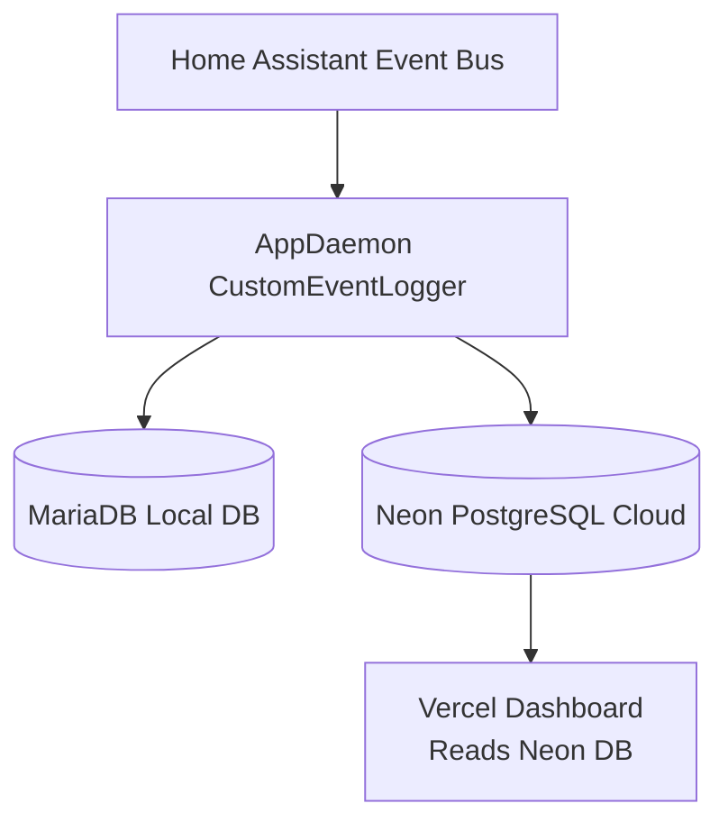
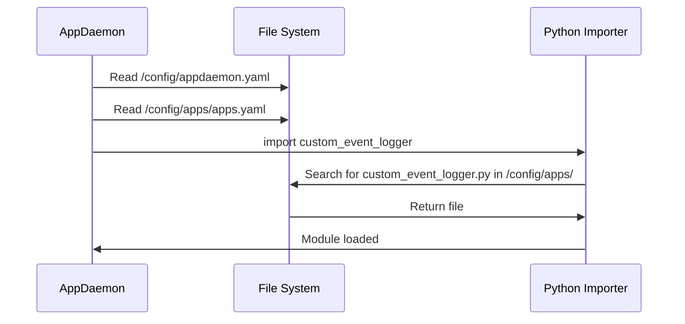
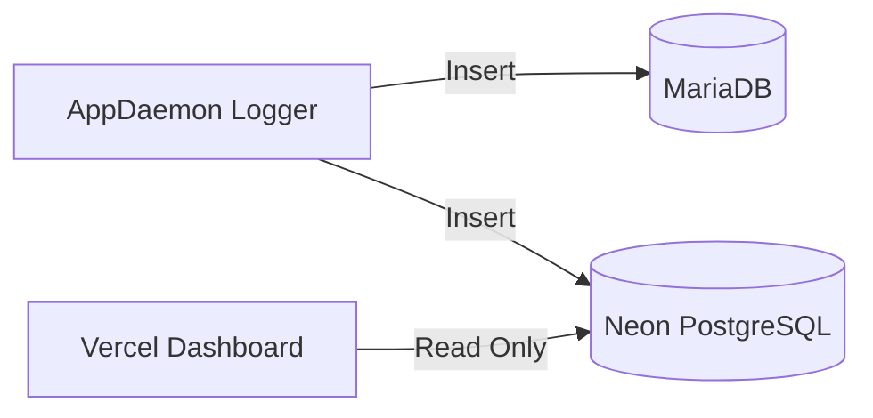
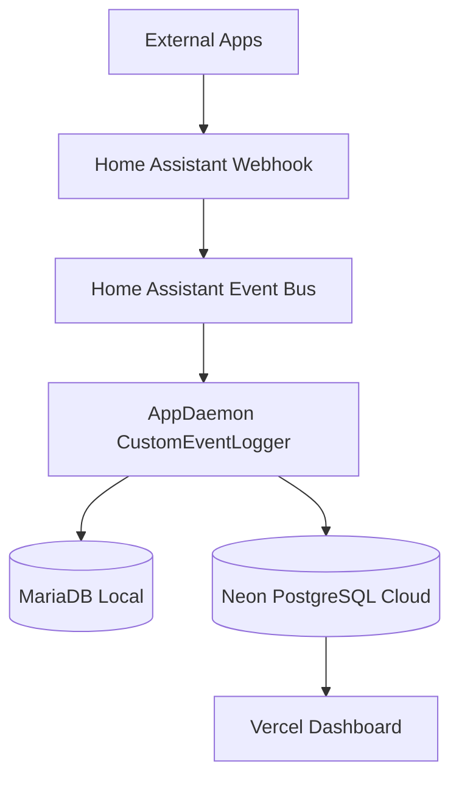

# Manhattan App Usage Logger — Full Installation, Architecture & Debug Guide
*(Version 1.0 — Single README with Full Table of Contents)*

# TABLE OF CONTENTS
1. [Introduction](#introduction)
2. [High-Level Architecture Diagram](#high-level-architecture-diagram)
3. [Event Schema](#event-schema)
4. [Folder Layout & File Responsibilities](#folder-layout--file-responsibilities)
5. [How AppDaemon Loads Modules](#how-appdaemon-loads-modules)
6. [Installation From Scratch](#installation-from-scratch)
7. [MariaDB & Neon Database Integration](#mariadb--neon-database-integration)
8. [Container Editing Rules](#container-editing-rules)
9. [Debugging Deep Dive](#debugging-deep-dive)
10. [Troubleshooting Guide](#troubleshooting-guide)
11. [Appendix: Full Mermaid Diagram Set](#appendix-full-mermaid-diagram-set)

---

# INTRODUCTION
This document fully describes the Manhattan App Usage Logger system used in Home Assistant. It is designed so ANY human or AI system can reinstall, debug, or extend the system from scratch.

The system listens for `app_usage_event` events in Home Assistant and logs them to:

- **MariaDB** (local)
- **Neon PostgreSQL** (cloud, used by Vercel dashboard)

---

# HIGH-LEVEL ARCHITECTURE DIAGRAM



---

# EVENT SCHEMA

Event emitted by external apps → HA webhook → AppDaemon:

| Field | Type | Required | Description |
|-------|------|----------|-------------|
| `app_name` | string | yes | Name of the app generating the event |
| `event_name` | string | yes | Action being logged |
| `org` | string / null | no | Optional organizational code |
| `timestamp` | ISO string | yes | Format: `YYYY-MM-DDTHH:MM:SSZ` |
| Additional fields | dict | no | Included in `event_data` JSON |

Example event payload:

```json
{
  "app_name": "facility-addresses",
  "event_name": "auth_success",
  "org": "Manhattan",
  "timestamp": "2025-12-11T18:26:59Z"
}
```

---

# FOLDER LAYOUT & FILE RESPONSIBILITIES

## **Critical File Locations**
```
/config/appdaemon.yaml               ← AppDaemon config
/config/apps/apps.yaml               ← App definitions
/config/apps/custom_event_logger.py  ← THE ONLY ACTIVE LOGGER SCRIPT
```

## Forbidden Locations
Do NOT place ANY AppDaemon `.py` inside:

```
/homeassistant/manhattan_dashboard/
/homeassistant/python_scripts/
/homeassistant/custom_components/
```

AppDaemon may accidentally import these and override your real script.

---

# HOW APPDAEMON LOADS MODULES



Important rules:

1. AppDaemon ONLY loads from `/config/apps/`.
2. Python may cache compiled `.pyc` files.
3. Duplicate filenames elsewhere in container can overshadow correct one.
4. Restarting AppDaemon reloads modules—BUT stale `.pyc` may still be used unless removed.

---

# INSTALLATION FROM SCRATCH

### 1. Install AppDaemon
Home Assistant → Add-ons → AppDaemon → Install.

### 2. Create appdaemon.yaml
```
/config/appdaemon.yaml
```

Contents:
```yaml
appdaemon:
  time_zone: America/New_York

plugins:
  HASS:
    type: hass
    ha_url: http://supervisor/core

http:
  url: http://0.0.0.0:5050
```

### 3. Create `/config/apps/`
```bash
mkdir -p /config/apps
```

### 4. Create apps.yaml
```yaml
custom_event_logger:
  module: custom_event_logger
  class: CustomEventLogger
```

### 5. Create custom_event_logger.py
Place the final working script here.

### 6. Restart AppDaemon
```bash
ha addons restart a0d7b954_appdaemon
```

---

# MARIADB & NEON DATABASE INTEGRATION



Both writes are independent. MariaDB writes do NOT block Neon writes.

Neon connection uses:

- SSL required
- Pooler endpoint
- `psycopg2`

---

# CONTAINER EDITING RULES

### YOU SHOULD EDIT FILES IN:
✔ `/config/apps/custom_event_logger.py`

### YOU SHOULD NOT EDIT FILES IN:
❌ `/usr/*` inside container  
❌ `/appdaemon/*` inside container  
❌ `/homeassistant/manhattan_dashboard/*`  

### When editing inside container is allowed
Only when AppDaemon refuses to reload Python modules.

Use:

```bash
docker cp /config/apps/custom_event_logger.py addon_a0d7b954_appdaemon:/config/apps/custom_event_logger.py
```

This forces module refresh.

---

# DEBUGGING DEEP DIVE

## Find all copies of logger script
```bash
docker exec -it addon_a0d7b954_appdaemon find / -name "custom_event_logger*.py"
```

Expected:
```
/config/apps/custom_event_logger.py
/homeassistant/apps/custom_event_logger.py
```

If you see anything else → delete or archive it.

## Remove stale caches:
```bash
find /homeassistant -type d -name "__pycache__" -exec rm -rf {} +
```

---

# TROUBLESHOOTING GUIDE

| Symptom | Cause | Fix |
|---------|-------|-----|
| DEBUG line appears after removal | Loaded wrong file | Remove duplicates; restart |
| Neon not inserting | SSL or connection issue | Check credentials; check Neon status |
| MariaDB not inserting | Wrong host | Use `core-mariadb` inside HA |
| App not loading | Wrong path | Ensure file is in `/config/apps/` |

---

# APPENDIX: FULL MERMAID DIAGRAM SET

## Full System Overview



## AppDaemon Search Path Logic

```mermaid
flowchart TD
    A[AppDaemon Start] --> B[Read appdaemon.yaml]
    B --> C[Read apps.yaml]
    C --> D{module: custom_event_logger}
    D --> E[Search /config/apps]
    E --> F[Load custom_event_logger.py]
    F --> G[Run initialize()]
```

---

# END OF README
