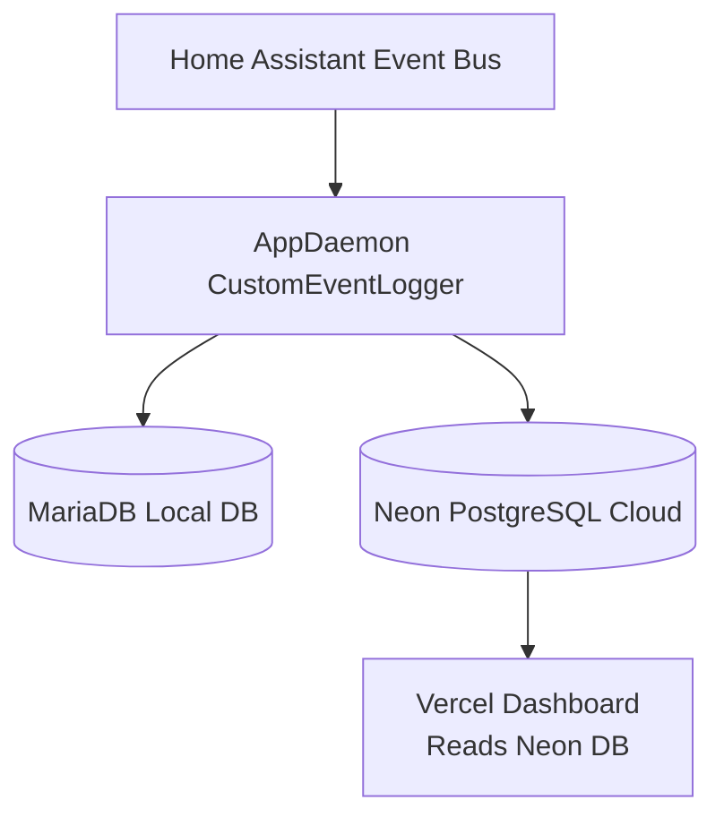
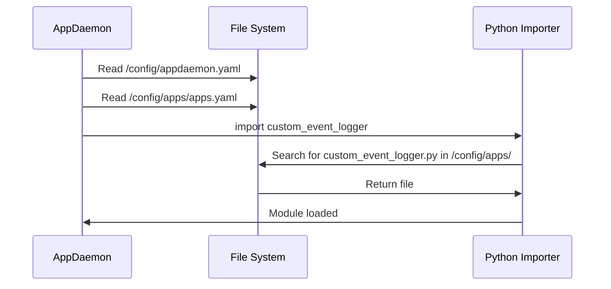
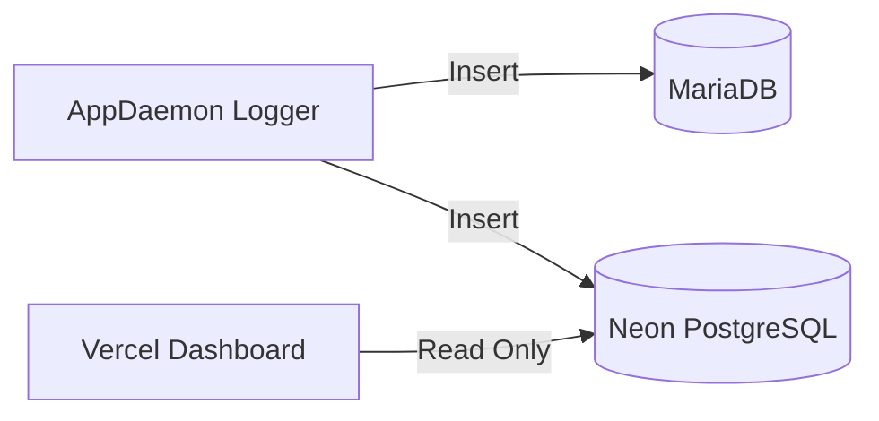
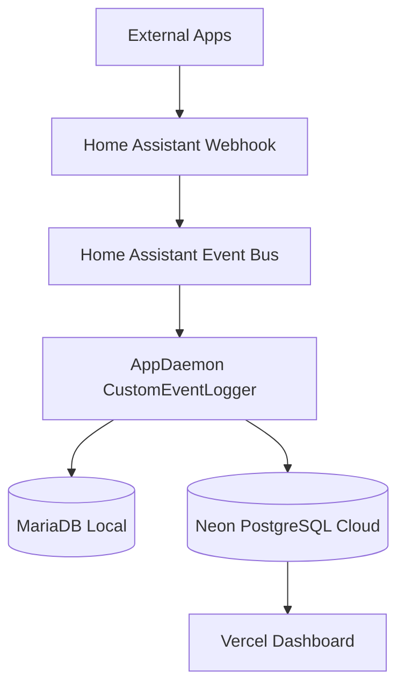

# Manhattan App Usage Logger — Full Installation, Architecture & Debug Guide
*(Version 1.2 — Added Comprehensive Deployment Guide)*

# TABLE OF CONTENTS
1. [Introduction](#introduction)
2. [High-Level Architecture Diagram](#high-level-architecture-diagram)
3. [Event Schema](#event-schema)
4. [Folder Layout & File Responsibilities](#folder-layout--file-responsibilities)
5. [Git Repository vs Home Assistant Structure](#git-repository-vs-home-assistant-structure)
6. [Deployment Guide: From Git to Home Assistant](#deployment-guide-from-git-to-home-assistant)
7. [How AppDaemon Loads Modules](#how-appdaemon-loads-modules)
8. [Installation From Scratch](#installation-from-scratch)
9. [MariaDB & Neon Database Integration](#mariadb--neon-database-integration)
10. [Container Editing Rules](#container-editing-rules)
11. [Debugging Deep Dive](#debugging-deep-dive)
12. [Troubleshooting Guide](#troubleshooting-guide)
13. [Appendix: Full Mermaid Diagram Set](#appendix-full-mermaid-diagram-set)

---

# INTRODUCTION
This document fully describes the Manhattan App Usage Logger system used in Home Assistant. It is designed so ANY human or AI system can reinstall, debug, or extend the system from scratch.

The system listens for `app_usage_event` events in Home Assistant and logs them to:

- **MariaDB** (local)
- **Neon PostgreSQL** (cloud, used by Vercel dashboard)

---

# HIGH-LEVEL ARCHITECTURE DIAGRAM



---

# EVENT SCHEMA

Event emitted by external apps → HA webhook → AppDaemon:

| Field | Type | Required | Description |
|-------|------|----------|-------------|
| `app_name` | string | yes | Name of the app generating the event |
| `event_name` | string | yes | Action being logged |
| `org` | string / null | no | Optional organizational code |
| `timestamp` | ISO string | yes | Format: `YYYY-MM-DDTHH:MM:SSZ` |
| Additional fields | dict | no | Included in `event_data` JSON |

Example event payload:

```json
{
  "app_name": "facility-addresses",
  "event_name": "auth_success",
  "org": "Manhattan",
  "timestamp": "2025-12-11T18:26:59Z"
}
```

---

# FOLDER LAYOUT & FILE RESPONSIBILITIES

## **Critical File Locations**
```
/config/appdaemon.yaml               ← AppDaemon config
/config/apps/apps.yaml               ← App definitions
/config/apps/custom_event_logger.py  ← THE ONLY ACTIVE LOGGER SCRIPT
```

## Forbidden Locations
Do NOT place ANY AppDaemon `.py` inside:

```
/homeassistant/manhattan_dashboard/
/homeassistant/python_scripts/
/homeassistant/custom_components/
```

AppDaemon may accidentally import these and override your real script.

---

# GIT REPOSITORY VS HOME ASSISTANT STRUCTURE

## Important: Folder Structure Mismatch

**Git stores files in one structure, but HA requires files in different locations.**

### Git Repository Structure

In your GitHub repository and local laptop, files are organized under `manhattan_dashboard/`:

```
apps_dashboard/
└── manhattan_dashboard/
    └── appdaemon/
        ├── appdaemon.yaml
        ├── README.md
        └── apps/
            ├── apps.yaml
            └── custom_event_logger.py
```

**Why this structure?**
- Keeps all dashboard-related files organized in one folder
- Easy to version control and track changes
- Clear separation from other HA configurations

### Home Assistant Required Structure

AppDaemon has **strict requirements** about where files must be located:

```
/config/
├── appdaemon.yaml          ← AppDaemon main config (MUST be here)
└── apps/
    ├── apps.yaml           ← App definitions (MUST be in /config/apps/)
    └── custom_event_logger.py  ← Logger script (MUST be in /config/apps/)
```

**Critical Rules:**
1. `appdaemon.yaml` MUST be at `/config/appdaemon.yaml` (not in a subfolder)
2. All app files MUST be in `/config/apps/` (not `/config/manhattan_dashboard/appdaemon/apps/`)
3. AppDaemon does NOT support symlinks for app files
4. AppDaemon searches ONLY in `/config/apps/` for Python modules

### The Mismatch Explained

| Location | Git Repository | Home Assistant |
|----------|---------------|----------------|
| Main Config | `manhattan_dashboard/appdaemon/appdaemon.yaml` | `/config/appdaemon.yaml` |
| App Definitions | `manhattan_dashboard/appdaemon/apps/apps.yaml` | `/config/apps/apps.yaml` |
| Logger Script | `manhattan_dashboard/appdaemon/apps/custom_event_logger.py` | `/config/apps/custom_event_logger.py` |

**Git does NOT automatically map these paths.** You must manually copy files from Git structure to HA structure when deploying.

---

# DEPLOYMENT GUIDE: FROM GIT TO HOME ASSISTANT

This section provides step-by-step instructions to deploy files from your Git repository to Home Assistant, ensuring files are in the correct locations for AppDaemon to work.

## Prerequisites

- Git repository cloned to your local machine
- Access to Home Assistant (SSH, Samba, or File Editor)
- AppDaemon add-on installed in HA

## Step-by-Step Deployment

### Step 1: Locate Files in Git Repository

On your local machine, navigate to the repository:

```bash
cd /path/to/apps_dashboard
# Or on Windows:
cd "C:\Users\ssmith\OneDrive - Manhattan Associates\Documents\Solutions Consulting\Scripts\Web\apps_dashboard"
```

Verify files exist:
```bash
# Check AppDaemon files
ls manhattan_dashboard/appdaemon/appdaemon.yaml
ls manhattan_dashboard/appdaemon/apps/apps.yaml
ls manhattan_dashboard/appdaemon/apps/custom_event_logger.py
```

### Step 2: Connect to Home Assistant

Choose one of these methods:

#### Option A: SSH (Recommended)

```bash
ssh homeassistant@your-ha-ip
# Or if using a different user:
ssh root@your-ha-ip
```

#### Option B: Samba/Network Share

1. Enable Samba add-on in HA
2. Map network drive: `\\your-ha-ip\config`
3. Navigate to the mapped drive

#### Option C: File Editor Add-on

1. Install "File Editor" add-on in HA
2. Open File Editor in HA web interface
3. Navigate to `/config/` directory

### Step 3: Copy AppDaemon Configuration File

**Source (Git):** `manhattan_dashboard/appdaemon/appdaemon.yaml`  
**Destination (HA):** `/config/appdaemon.yaml`

#### Using SSH/SCP:

```bash
# From your local machine (outside HA)
scp manhattan_dashboard/appdaemon/appdaemon.yaml homeassistant@your-ha-ip:/config/appdaemon.yaml
```

#### Using SSH (inside HA):

```bash
# If you've already copied the entire manhattan_dashboard folder to HA:
cp /config/manhattan_dashboard/appdaemon/appdaemon.yaml /config/appdaemon.yaml
```

#### Using File Editor:

1. Open `manhattan_dashboard/appdaemon/appdaemon.yaml` in File Editor
2. Copy all contents
3. Navigate to `/config/`
4. Create new file `appdaemon.yaml`
5. Paste contents
6. Save

### Step 4: Create Apps Directory (If Not Exists)

```bash
# Via SSH
mkdir -p /config/apps

# Via File Editor: Create folder `/config/apps/`
```

### Step 5: Copy App Definition File

**Source (Git):** `manhattan_dashboard/appdaemon/apps/apps.yaml`  
**Destination (HA):** `/config/apps/apps.yaml`

#### Using SSH/SCP:

```bash
# From your local machine
scp manhattan_dashboard/appdaemon/apps/apps.yaml homeassistant@your-ha-ip:/config/apps/apps.yaml
```

#### Using SSH (inside HA):

```bash
cp /config/manhattan_dashboard/appdaemon/apps/apps.yaml /config/apps/apps.yaml
```

#### Using File Editor:

1. Open `manhattan_dashboard/appdaemon/apps/apps.yaml`
2. Copy all contents
3. Navigate to `/config/apps/`
4. Create new file `apps.yaml`
5. Paste contents
6. Save

### Step 6: Copy Logger Script

**Source (Git):** `manhattan_dashboard/appdaemon/apps/custom_event_logger.py`  
**Destination (HA):** `/config/apps/custom_event_logger.py`

#### Using SSH/SCP:

```bash
# From your local machine
scp manhattan_dashboard/appdaemon/apps/custom_event_logger.py homeassistant@your-ha-ip:/config/apps/custom_event_logger.py
```

#### Using SSH (inside HA):

```bash
cp /config/manhattan_dashboard/appdaemon/apps/custom_event_logger.py /config/apps/custom_event_logger.py
```

#### Using File Editor:

1. Open `manhattan_dashboard/appdaemon/apps/custom_event_logger.py`
2. Copy all contents
3. Navigate to `/config/apps/`
4. Create new file `custom_event_logger.py`
5. Paste contents
6. Save

### Step 7: Verify File Locations

**Critical:** Verify files are in the EXACT locations AppDaemon expects:

```bash
# Via SSH, check all files exist:
ls -la /config/appdaemon.yaml
ls -la /config/apps/apps.yaml
ls -la /config/apps/custom_event_logger.py
```

**Expected output:**
```
-rw-r--r-- 1 root root   XXX /config/appdaemon.yaml
-rw-r--r-- 1 root root   XXX /config/apps/apps.yaml
-rw-r--r-- 1 root root   XXX /config/apps/custom_event_logger.py
```

**If files are missing or in wrong location, AppDaemon will NOT load them!**

### Step 8: Verify File Permissions

Ensure files are readable:

```bash
chmod 644 /config/appdaemon.yaml
chmod 644 /config/apps/apps.yaml
chmod 644 /config/apps/custom_event_logger.py
```

### Step 9: Restart AppDaemon

After copying files, restart AppDaemon to load the new configuration:

```bash
# Via HA Supervisor (web UI)
# Settings → Add-ons → AppDaemon → Restart

# Or via SSH:
ha addons restart a0d7b954_appdaemon
```

### Step 10: Verify AppDaemon Loaded Files

Check AppDaemon logs to confirm files loaded:

```bash
# Via HA web UI
# Settings → Add-ons → AppDaemon → Logs

# Or via SSH:
docker logs addon_a0d7b954_appdaemon
```

**Look for:**
```
CustomEventLogger initialized - listening for app_usage_event
```

If you see this message, the app loaded successfully!

## Quick Deployment Script

For faster deployment, create a script on your local machine:

### Linux/Mac Script (`deploy-appdaemon.sh`):

```bash
#!/bin/bash

# Configuration
HA_HOST="your-ha-ip"
HA_USER="homeassistant"
REPO_PATH="/path/to/apps_dashboard"

# Copy files
scp ${REPO_PATH}/manhattan_dashboard/appdaemon/appdaemon.yaml ${HA_USER}@${HA_HOST}:/config/appdaemon.yaml
ssh ${HA_USER}@${HA_HOST} "mkdir -p /config/apps"
scp ${REPO_PATH}/manhattan_dashboard/appdaemon/apps/apps.yaml ${HA_USER}@${HA_HOST}:/config/apps/apps.yaml
scp ${REPO_PATH}/manhattan_dashboard/appdaemon/apps/custom_event_logger.py ${HA_USER}@${HA_HOST}:/config/apps/custom_event_logger.py

# Set permissions
ssh ${HA_USER}@${HA_HOST} "chmod 644 /config/appdaemon.yaml /config/apps/apps.yaml /config/apps/custom_event_logger.py"

# Restart AppDaemon
ssh ${HA_USER}@${HA_HOST} "ha addons restart a0d7b954_appdaemon"

echo "Deployment complete! Check AppDaemon logs to verify."
```

### Windows PowerShell Script (`deploy-appdaemon.ps1`):

```powershell
# Configuration
$HA_HOST = "your-ha-ip"
$HA_USER = "homeassistant"
$REPO_PATH = "C:\Users\ssmith\OneDrive - Manhattan Associates\Documents\Solutions Consulting\Scripts\Web\apps_dashboard"

# Copy files via SCP (requires OpenSSH or WinSCP)
scp "${REPO_PATH}\manhattan_dashboard\appdaemon\appdaemon.yaml" "${HA_USER}@${HA_HOST}:/config/appdaemon.yaml"
ssh ${HA_USER}@${HA_HOST} "mkdir -p /config/apps"
scp "${REPO_PATH}\manhattan_dashboard\appdaemon\apps\apps.yaml" "${HA_USER}@${HA_HOST}:/config/apps/apps.yaml"
scp "${REPO_PATH}\manhattan_dashboard\appdaemon\apps\custom_event_logger.py" "${HA_USER}@${HA_HOST}:/config/apps/custom_event_logger.py"

# Set permissions and restart
ssh ${HA_USER}@${HA_HOST} "chmod 644 /config/appdaemon.yaml /config/apps/apps.yaml /config/apps/custom_event_logger.py"
ssh ${HA_USER}@${HA_HOST} "ha addons restart a0d7b954_appdaemon"

Write-Host "Deployment complete! Check AppDaemon logs to verify."
```

## File Mapping Reference Table

| Purpose | Git Repository Path | Home Assistant Path | Required? |
|---------|---------------------|---------------------|-----------|
| AppDaemon Config | `manhattan_dashboard/appdaemon/appdaemon.yaml` | `/config/appdaemon.yaml` | ✅ Yes |
| App Definitions | `manhattan_dashboard/appdaemon/apps/apps.yaml` | `/config/apps/apps.yaml` | ✅ Yes |
| Logger Script | `manhattan_dashboard/appdaemon/apps/custom_event_logger.py` | `/config/apps/custom_event_logger.py` | ✅ Yes |
| Documentation | `manhattan_dashboard/appdaemon/README.md` | `/config/manhattan_dashboard/appdaemon/README.md` (optional) | ❌ No |

## Why This Structure?

### Git Repository Structure (Organized)
- **Purpose:** Version control, organization, documentation
- **Location:** `manhattan_dashboard/appdaemon/`
- **Benefits:**
  - All dashboard files in one place
  - Easy to track changes
  - Clear documentation structure
  - Can include related files (SQL, templates, etc.)

### Home Assistant Structure (Required)
- **Purpose:** AppDaemon runtime requirements
- **Location:** `/config/appdaemon.yaml` and `/config/apps/`
- **Requirements:**
  - AppDaemon ONLY searches `/config/apps/` for Python modules
  - `appdaemon.yaml` MUST be at `/config/appdaemon.yaml`
  - No symlink support for app files
  - Hardcoded paths in AppDaemon code

## Common Deployment Mistakes

| Mistake | Symptom | Fix |
|---------|---------|-----|
| Files in wrong location | AppDaemon doesn't load app | Move files to `/config/apps/` |
| Using symlinks | AppDaemon can't find modules | Copy files directly (no symlinks) |
| Wrong file permissions | Permission denied errors | Run `chmod 644` on all files |
| Forgot to restart | Changes not applied | Restart AppDaemon add-on |
| Files in subfolder | Module not found | Files MUST be directly in `/config/apps/` |

## Updating Files After Git Pull

When you pull updates from Git:

1. **Pull latest changes:**
   ```bash
   git pull origin main
   ```

2. **Copy updated files to HA:**
   ```bash
   # Repeat Steps 3-6 from deployment guide
   scp manhattan_dashboard/appdaemon/appdaemon.yaml homeassistant@your-ha-ip:/config/appdaemon.yaml
   scp manhattan_dashboard/appdaemon/apps/apps.yaml homeassistant@your-ha-ip:/config/apps/apps.yaml
   scp manhattan_dashboard/appdaemon/apps/custom_event_logger.py homeassistant@your-ha-ip:/config/apps/custom_event_logger.py
   ```

3. **Restart AppDaemon:**
   ```bash
   ssh homeassistant@your-ha-ip "ha addons restart a0d7b954_appdaemon"
   ```

## Verification Checklist

After deployment, verify:

- [ ] `/config/appdaemon.yaml` exists and has correct content
- [ ] `/config/apps/apps.yaml` exists and has correct content
- [ ] `/config/apps/custom_event_logger.py` exists and has correct content
- [ ] All files have read permissions (`chmod 644`)
- [ ] AppDaemon restarted successfully
- [ ] AppDaemon logs show: `CustomEventLogger initialized`
- [ ] Test event fires and logs to both MariaDB and Neon

---

# HOW APPDAEMON LOADS MODULES



Important rules:

1. AppDaemon ONLY loads from `/config/apps/`.
2. Python may cache compiled `.pyc` files.
3. Duplicate filenames elsewhere in container can overshadow correct one.
4. Restarting AppDaemon reloads modules—BUT stale `.pyc` may still be used unless removed.

---

# INSTALLATION FROM SCRATCH

### 1. Install AppDaemon
Home Assistant → Add-ons → AppDaemon → Install.

### 2. Create appdaemon.yaml
```
/config/appdaemon.yaml
```

Contents:
```yaml
appdaemon:
  time_zone: America/New_York

plugins:
  HASS:
    type: hass
    ha_url: http://supervisor/core

http:
  url: http://0.0.0.0:5050
```

### 3. Create `/config/apps/`
```bash
mkdir -p /config/apps
```

### 4. Create apps.yaml
```yaml
custom_event_logger:
  module: custom_event_logger
  class: CustomEventLogger
```

### 5. Configure Python Packages

In AppDaemon Add-on Configuration, add:

```yaml
system_packages: []
python_packages:
  - mysql-connector-python  # For MariaDB
  - psycopg2-binary          # For Neon PostgreSQL
init_commands: []
```

**Important:** `psycopg2-binary` is required for Neon PostgreSQL writes. The `-binary` variant includes pre-compiled binaries and avoids compilation issues.

### 6. Create custom_event_logger.py

Place the final working script in `/config/apps/custom_event_logger.py`.

The script should:
- Listen for `app_usage_event` events
- Write to MariaDB (local backup)
- Write to Neon PostgreSQL (cloud, for dashboard)

**File Location:** `/config/apps/custom_event_logger.py`

### 7. Configure Database Credentials

**⚠️ SECURITY WARNING:** Currently credentials are hardcoded. For production, move to environment variables.

**MariaDB:**
- Host: `core-mariadb` (internal HA network)
- Database: `manhattan_app_usage`
- User/Password: See code comments

**Neon PostgreSQL:**
- Host: Pooler endpoint (see code)
- Database: `neondb`
- User/Password: See code comments
- SSL: Required (`sslmode="require"`)

### 8. Deploy Files from Git Repository

**⚠️ CRITICAL:** AppDaemon files in Git are organized under `manhattan_dashboard/appdaemon/`, but HA requires them in specific locations.

**You MUST copy files from Git structure to HA structure:**

| Git Location | HA Required Location |
|--------------|---------------------|
| `manhattan_dashboard/appdaemon/appdaemon.yaml` | `/config/appdaemon.yaml` |
| `manhattan_dashboard/appdaemon/apps/apps.yaml` | `/config/apps/apps.yaml` |
| `manhattan_dashboard/appdaemon/apps/custom_event_logger.py` | `/config/apps/custom_event_logger.py` |

**See [Deployment Guide](#deployment-guide-from-git-to-home-assistant) for detailed instructions.**

**Quick copy commands (from your local machine):**
```bash
# Set your HA host and user
HA_HOST="your-ha-ip"
HA_USER="homeassistant"

# Copy files
scp manhattan_dashboard/appdaemon/appdaemon.yaml ${HA_USER}@${HA_HOST}:/config/appdaemon.yaml
ssh ${HA_USER}@${HA_HOST} "mkdir -p /config/apps"
scp manhattan_dashboard/appdaemon/apps/apps.yaml ${HA_USER}@${HA_HOST}:/config/apps/apps.yaml
scp manhattan_dashboard/appdaemon/apps/custom_event_logger.py ${HA_USER}@${HA_HOST}:/config/apps/custom_event_logger.py
```

### 9. Restart AppDaemon
```bash
ha addons restart a0d7b954_appdaemon
```

---

# MARIADB & NEON DATABASE INTEGRATION



## Dual-Write Architecture

The logger writes to **both databases independently**:
- **MariaDB** (local): Backup/legacy support, local queries
- **Neon PostgreSQL** (cloud): Primary database for Vercel dashboard

**Key Points:**
- Both writes happen in the same event handler
- If MariaDB write fails, Neon write still executes
- If Neon write fails, MariaDB write still succeeds
- No blocking between the two writes
- Each database connection is independent

## MariaDB Configuration

**Connection Details:**
- Host: `core-mariadb` (internal HA Docker network)
- Port: `3306`
- Database: `manhattan_app_usage`
- User: `homeassistant`
- Password: Stored in code (⚠️ should be moved to secrets)

**Schema:**
- Table: `app_usage_events`
- Columns: `id`, `event_name`, `app_name`, `org`, `timestamp`, `event_data` (JSON)

## Neon PostgreSQL Configuration

**Connection Details:**
- Host: `ep-small-firefly-aha9kbbm-pooler.c-3.us-east-1.aws.neon.tech`
- Database: `neondb`
- User: `neondb_owner`
- Password: `npg_HCWtem4D6fcR` (⚠️ should be moved to environment variables)
- SSL Mode: `require` (mandatory)
- Connection Timeout: `5` seconds
- Endpoint Type: **Pooler** (for better connection management)

**Why Pooler Endpoint:**
- Better connection handling for serverless/cloud environments
- Automatic connection pooling
- Optimized for Vercel serverless functions

**Schema:**
- Table: `app_usage_events` (same structure as MariaDB)
- Columns: `id`, `event_name`, `app_name`, `org`, `timestamp`, `event_data` (JSONB in PostgreSQL)

**Required Python Package:**
- `psycopg2` (PostgreSQL adapter for Python)
- Must be added to AppDaemon's `python_packages` configuration

## AppDaemon Python Packages Configuration

To enable Neon writes, ensure AppDaemon has `psycopg2` installed:

**In AppDaemon Add-on Configuration:**
```yaml
system_packages: []
python_packages:
  - mysql-connector-python  # For MariaDB
  - psycopg2-binary          # For Neon PostgreSQL (use -binary for easier installation)
init_commands: []
```

**Note:** `psycopg2-binary` is recommended over `psycopg2` as it includes pre-compiled binaries and avoids compilation issues.

## Error Handling

**MariaDB Errors:**
- Logged as `ERROR` level
- Transaction rolled back on failure
- Connection closed in `finally` block

**Neon Errors:**
- Logged as `WARNING` level (🟡 emoji in logs)
- Does NOT affect MariaDB write
- Connection automatically closed
- Event processing continues

**Success Indicators:**
- MariaDB: `"Logged event to MariaDB: {app_name} - {event_name}"`
- Neon: `"🟢 Neon: Inserted {app_name} - {event_name}"`

## Security Considerations

**⚠️ CRITICAL: Credentials in Code**

Currently, both MariaDB and Neon credentials are hardcoded in `custom_event_logger.py`. This is **NOT recommended for production**.

**Recommended Approach:**
1. Move credentials to AppDaemon environment variables
2. Access via `os.getenv()` or AppDaemon secrets
3. Never commit credentials to Git

**Example (Future Improvement):**
```python
import os

# MariaDB
password = os.getenv("MARIADB_PASSWORD", "default")

# Neon
neon_password = os.getenv("NEON_PASSWORD")
neon_host = os.getenv("NEON_HOST")
```

## Troubleshooting Database Writes

| Symptom | Database | Cause | Fix |
|---------|----------|-------|-----|
| "MariaDB error" | MariaDB | Connection failed | Check `core-mariadb` is running, verify credentials |
| "Neon insert failed" | Neon | SSL or connection issue | Check Neon status, verify pooler endpoint, check credentials |
| Only one DB has data | Both | One write failing silently | Check AppDaemon logs for specific error messages |
| No data in either | Both | Event not firing | Check HA event bus, verify automation is triggering |

---

# CONTAINER EDITING RULES

### YOU SHOULD EDIT FILES IN:
✔ `/config/apps/custom_event_logger.py`

### YOU SHOULD NOT EDIT FILES IN:
❌ `/usr/*` inside container  
❌ `/appdaemon/*` inside container  
❌ `/homeassistant/manhattan_dashboard/*`  

### When editing inside container is allowed
Only when AppDaemon refuses to reload Python modules.

Use:

```bash
docker cp /config/apps/custom_event_logger.py addon_a0d7b954_appdaemon:/config/apps/custom_event_logger.py
```

This forces module refresh.

---

# DEBUGGING DEEP DIVE

## Find all copies of logger script
```bash
docker exec -it addon_a0d7b954_appdaemon find / -name "custom_event_logger*.py"
```

Expected:
```
/config/apps/custom_event_logger.py
/homeassistant/apps/custom_event_logger.py
```

If you see anything else → delete or archive it.

## Remove stale caches:
```bash
find /homeassistant -type d -name "__pycache__" -exec rm -rf {} +
```

---

# TROUBLESHOOTING GUIDE

| Symptom | Cause | Fix |
|---------|-------|-----|
| DEBUG line appears after removal | Loaded wrong file | Remove duplicates; restart |
| Neon not inserting | SSL or connection issue | Check credentials; check Neon status; verify `psycopg2-binary` installed |
| MariaDB not inserting | Wrong host | Use `core-mariadb` inside HA; verify MariaDB add-on running |
| App not loading | Wrong path | Ensure file is in `/config/apps/` |
| "ModuleNotFoundError: No module named 'psycopg2'" | Missing package | Add `psycopg2-binary` to AppDaemon `python_packages` config |
| "Neon insert failed: connection timeout" | Network/SSL issue | Check Neon pooler endpoint; verify SSL mode; check firewall |
| Only MariaDB writes succeed | Neon connection failing | Check AppDaemon logs for Neon-specific errors; verify credentials |
| Only Neon writes succeed | MariaDB connection failing | Check `core-mariadb` is running; verify MariaDB credentials |

---

# APPENDIX: FULL MERMAID DIAGRAM SET

## Full System Overview



## AppDaemon Search Path Logic

```mermaid
flowchart TD
    A[AppDaemon Start] --> B[Read appdaemon.yaml]
    B --> C[Read apps.yaml]
    C --> D{module: custom_event_logger}
    D --> E[Search /config/apps]
    E --> F[Load custom_event_logger.py]
    F --> G[Run initialize()]
```

---

# END OF README
